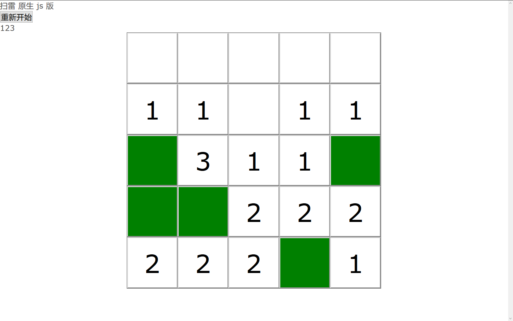
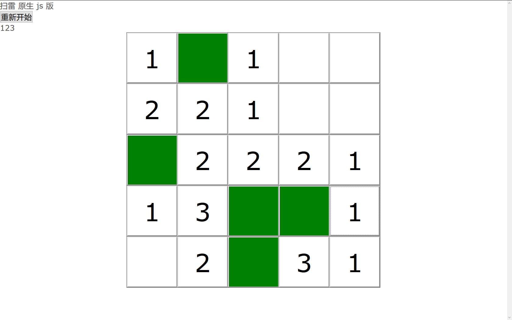
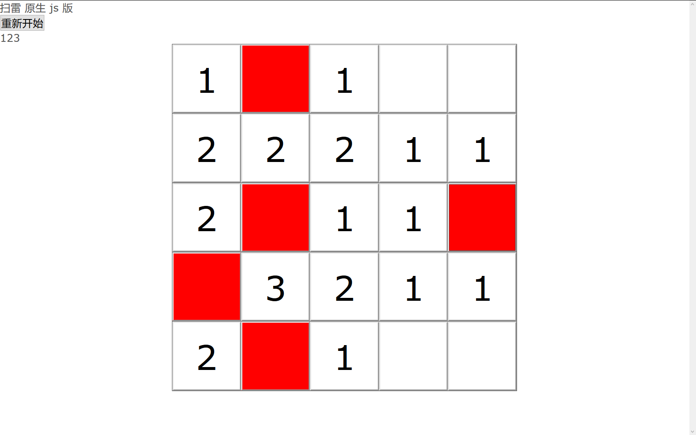
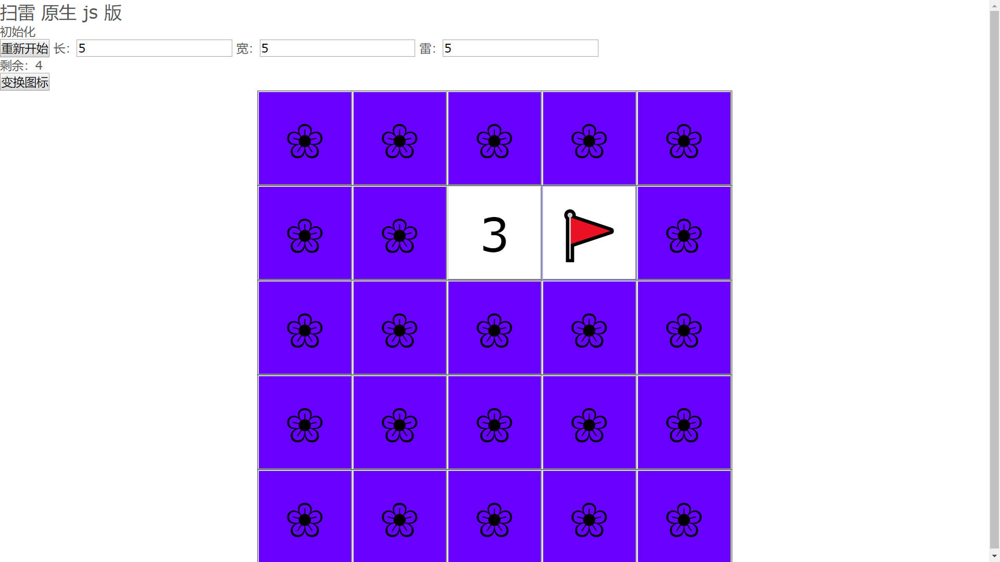

# 扫雷
## 简介
该项目计划创建一个网页版的扫雷游戏

## 快速体验
下载该项目后直接双击打开 index.html 就可以了。
可以省略服务器。

## 运行效果截图




## 使用方法
### 页面示例代码
```js
let field = new Field();
field.init(5, 5, 1);
let root = field.getDomRoot();
let test = document.getElementById('test');
test.appendChild(root)
```

### 步骤详细解析
1. 创建一个扫雷模块
```js
let field = new Field();
```
2. 初始化该模块，其中的三个参数是长、宽 和 雷数
```js
field.init(5, 5, 1);
```
3. 获取当前模块的 dom 根节点，添加到你希望的任何位置。
```js
let root = field.getDomRoot();
```
4. 如果要重新开始游戏的话，可以再次调用 `init`

## 高级技巧
### 回调函数
共有四个回调函数：
```js
whenInit()
whenSuccess()
whenFailure()
whenFinish()
```
1. 当游戏被初始化时执行`whenInit`，也就是 `init` 函数被调用的时候
2. 当游戏胜利后执行 `whenSuccess`。
3. 当游戏失败后执行 `whenSuccess`。
4. 无论成功或失败，都会最后进入 `finish` 状态，并调用 `whenFinish`

### 设置图标
#### 简介
图标指的是显示在格子中的图案，包括如下几种：
- `empty`  空白时的图案
- `flag`   右键立旗子时的图案
- `clear`  游戏胜利时原来是地雷的地方显示的图案
- `num$`   (`$` 从 0 到 8 表示周围地雷数量)周围有 `$` 各雷时的图标。
    如 `num0` 就是周围没有雷时显示的结果。

#### 使用方法
```js
let field = new Field();
field.setIcon('flag','🐧');
```
即可设置图标名为 `flag` 的图标为 `🐧`。


#### 效果
- 设置右键插旗为企鹅 `🐧`
  ```js
  field.setIcon('flag', '🐧');
  ```
  

- 设置游戏结束显示为笑脸
  ```js
  field.setIcon('clear', '😜');
  ```
  

- 设置游戏默认背景图案为花`❀`
  ```js
  field.setIcon('empty', '❀');
  ```
  

#### 注意事项
`setIcon()` 函数并不是总能成功，其返回是否设置成功
- `true` 表示对应 icon 现在是设置的那个图标了
- `false` 表示 icon 还不是设置的图标，设置失败了

有一下几点需要注意：
- 希望设置的图案与其他已有的图案相同会导致设置失败。  
  如旗子 `flag` 是 `🚩`，那么设置 `clear` 为 `🚩`就会失败。  
  默认图标有：
  - 数字 `num1 = '1'` 到 `num9 = '9'`
  - 数字 `num0 = ' '` （一个空格）
  - 结束排雷 `clear = '  '`（两个空格）
  - 未点击处 `empty = ''` （空白）
  - 旗子 `flag = '🚩'`
- 重复设置不会返回 `false`，如多次设置 `flag` 为 `🚩`，返回都是 `true`
- 如果确实需要交换某个字符，如设置 `flag` 为两个空格，并设置 `clear` 为 `🚩`。
  可以通过这种写法：
  ```js
  field.setIcon('flag', '_');
  field.setIcon('clear', '🚩');
  field.setIcon('flag', '  ');
  ```