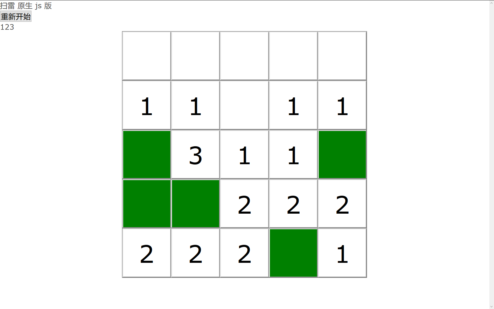
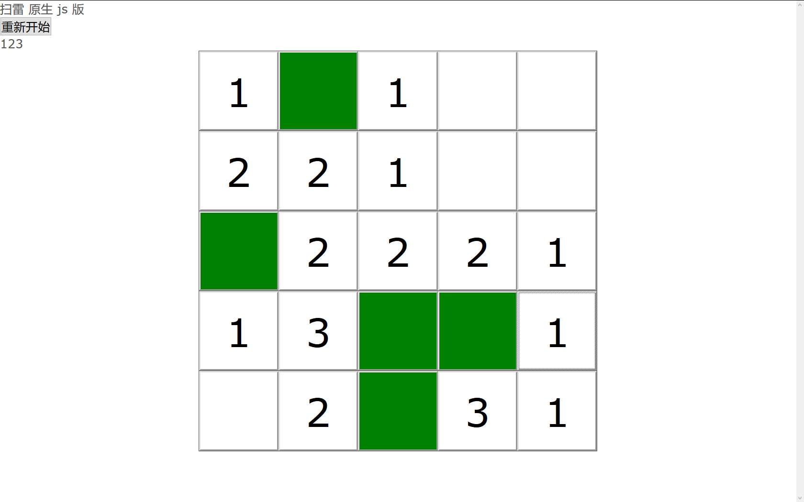
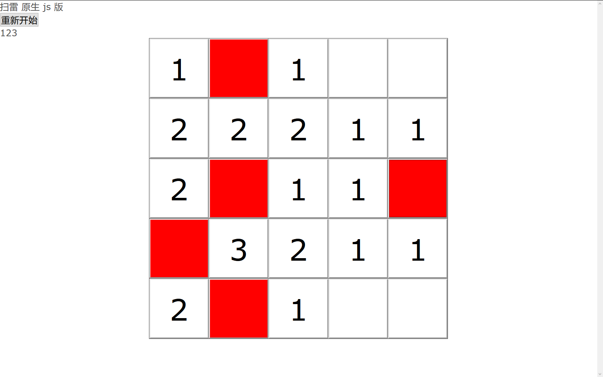

# 扫雷
## 简介
该项目计划创建一个网页版的扫雷游戏

## 快速体验
下载该项目后直接双击打开 index.html 就可以了。
可以省略服务器。

## 运行效果截图




## 使用方法
### 页面示例代码
```js
let field = new Field();
field.init(5, 5, 1);
let root = field.getDomRoot();
let test = document.getElementById('test');
test.appendChild(root)
```

### 步骤详细解析
1. 创建一个扫雷模块
```js
let field = new Field();
```
2. 初始化该模块，其中的三个参数是长、宽 和 雷数
```js
field.init(5, 5, 1);
```
3. 获取当前模块的 dom 根节点，添加到你希望的任何位置。
```js
let root = field.getDomRoot();
```
4. 如果要重新开始游戏的话，可以再次调用 `init`

## 高级技巧
### 回调函数
共有四个回调函数：
```js
whenInit()
whenSuccess()
whenFailure()
whenFinish()
```
1. 当游戏被初始化时执行`whenInit`，也就是 `init` 函数被调用的时候
2. 当游戏胜利后执行 `whenSuccess`。
3. 当游戏失败后执行 `whenSuccess`。
4. 无论成功或失败，都会最后进入 `finish` 状态，并调用 `whenFinish`